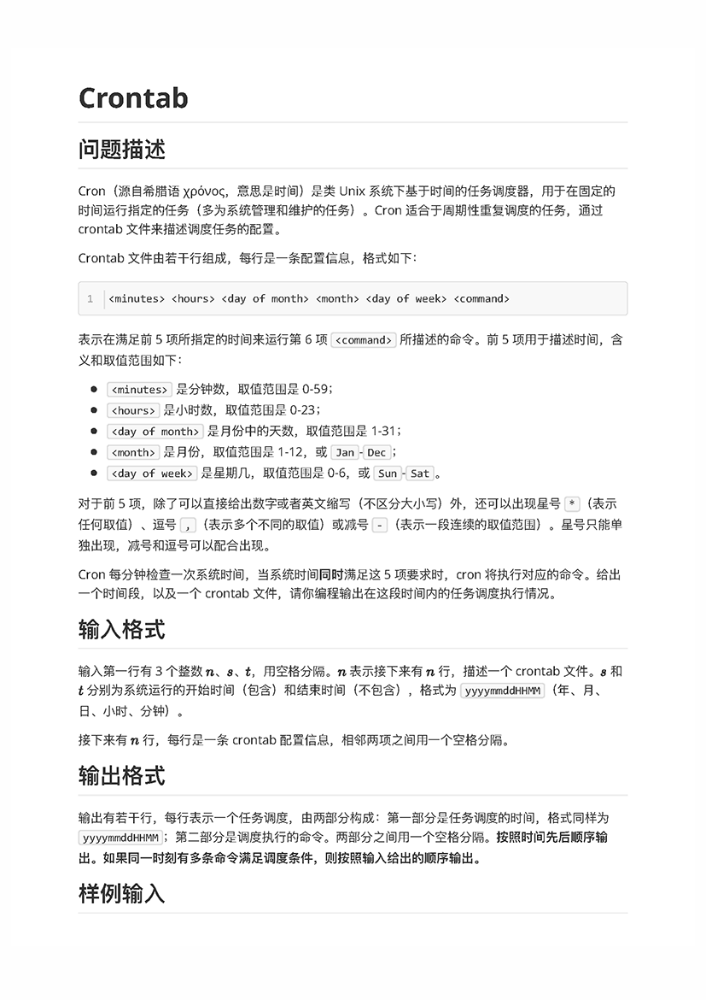
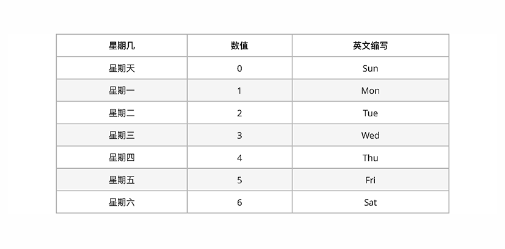
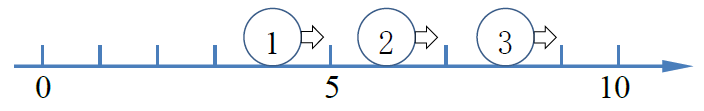
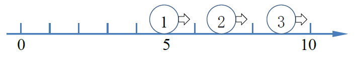
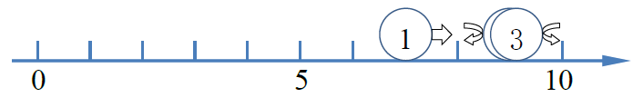
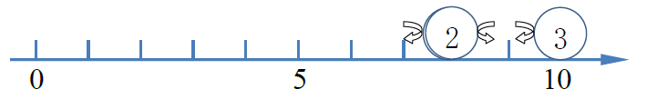
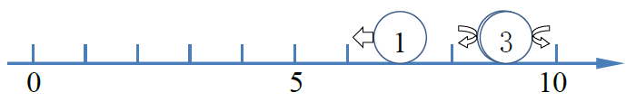
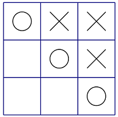

# 201703-2-学生排队

问题描述

　　体育老师小明要将自己班上的学生按顺序排队。他首先让学生按学号从小到大的顺序排成一排，学号小的排在前面，然后进行多次调整。一次调整小明可能让一位同学出队，向前或者向后移动一段距离后再插入队列。
　　例如，下面给出了一组移动的例子，例子中学生的人数为8人。
　　0）初始队列中学生的学号依次为1, 2, 3, 4, 5, 6, 7, 8；
　　1）第一次调整，命令为“3号同学向后移动2”，表示3号同学出队，向后移动2名同学的距离，再插入到队列中，新队列中学生的学号依次为1, 2, 4, 5, 3, 6, 7, 8；
　　2）第二次调整，命令为“8号同学向前移动3”，表示8号同学出队，向前移动3名同学的距离，再插入到队列中，新队列中学生的学号依次为1, 2, 4, 5, 8, 3, 6, 7；
　　3）第三次调整，命令为“3号同学向前移动2”，表示3号同学出队，向前移动2名同学的距离，再插入到队列中，新队列中学生的学号依次为1, 2, 4, 3, 5, 8, 6, 7。
　　小明记录了所有调整的过程，请问，最终从前向后所有学生的学号依次是多少？
　　请特别注意，上述移动过程中所涉及的号码指的是学号，而不是在队伍中的位置。在向后移动时，移动的距离不超过对应同学后面的人数，如果向后移动的距离正好等于对应同学后面的人数则该同学会移动到队列的最后面。在向前移动时，移动的距离不超过对应同学前面的人数，如果向前移动的距离正好等于对应同学前面的人数则该同学会移动到队列的最前面。

输入格式

　　输入的第一行包含一个整数*n*，表示学生的数量，学生的学号由1到*n*编号。
　　第二行包含一个整数*m*，表示调整的次数。
　　接下来m行，每行两个整数p, q，如果q为正，表示学号为p的同学向后移动q，如果q为负，表示学号为p的同学向前移动-q。

输出格式

　　输出一行，包含n个整数，相邻两个整数之间由一个空格分隔，表示最终从前向后所有学生的学号。

样例输入

8
3
3 2
8 -3
3 -2

样例输出

1 2 4 3 5 8 6 7

评测用例规模与约定

　　对于所有评测用例，1 ≤ *n* ≤ 1000，1 ≤ *m* ≤ 1000，所有移动均合法。

# 201712-1-最小差值

问题描述

　　给定*n*个数，请找出其中相差（差的绝对值）最小的两个数，输出它们的差值的绝对值。

输入格式

　　输入第一行包含一个整数*n*。
　　第二行包含*n*个正整数，相邻整数之间使用一个空格分隔。

输出格式

　　输出一个整数，表示答案。

样例输入

5
1 5 4 8 20

样例输出

1

样例说明

　　相差最小的两个数是5和4，它们之间的差值是1。

样例输入

5
9 3 6 1 3

样例输出

0

样例说明

　　有两个相同的数3，它们之间的差值是0.

数据规模和约定

　　对于所有评测用例，2 ≤ *n* ≤ 1000，每个给定的整数都是不超过10000的正整数。

## 参考代码

```c++
#include<cstdio>
#include<iostream>
#include<cmath>
using namespace std;
#define MAXIMUM 0x7FFFFFFF
#define MAXN 1001
int main(){
    int num[MAXN];
    int n;
    cin>>n;
    int min_num = MAXIMUM;
    for(int i=0; i<n; ++i){
        cin>>num[i];
        for(int j=0; j<i; ++j){
            int tmp = abs(num[i]-num[j]);
            if(tmp < min_num){
                min_num = tmp;
            }
        }
    }
    cout<<min_num<<endl;
    return 0;
}

```


# 201712-2-游戏

问题描述

　　有*n*个小朋友围成一圈玩游戏，小朋友从1至*n*编号，2号小朋友坐在1号小朋友的顺时针方向，3号小朋友坐在2号小朋友的顺时针方向，……，1号小朋友坐在*n*号小朋友的顺时针方向。
　　游戏开始，从1号小朋友开始顺时针报数，接下来每个小朋友的报数是上一个小朋友报的数加1。若一个小朋友报的数为*k*的倍数或其末位数（即数的个位）为*k*，则该小朋友被淘汰出局，不再参加以后的报数。当游戏中只剩下一个小朋友时，该小朋友获胜。
　　例如，当n=5, k=2时：
　　1号小朋友报数1；
　　2号小朋友报数2淘汰；
　　3号小朋友报数3；
　　4号小朋友报数4淘汰；
　　5号小朋友报数5；
　　1号小朋友报数6淘汰；
　　3号小朋友报数7；
　　5号小朋友报数8淘汰；
　　3号小朋友获胜。

　　给定*n*和*k*，请问最后获胜的小朋友编号为多少？

输入格式

　　输入一行，包括两个整数*n*和*k*，意义如题目所述。

输出格式

　　输出一行，包含一个整数，表示获胜的小朋友编号。

样例输入

5 2

样例输出

3

样例输入

7 3

样例输出

4

数据规模和约定

　　对于所有评测用例，1 ≤ *n* ≤ 1000，1 ≤ *k* ≤ 9。

## 想法

一个比较正常的想法是循环链表。但是我在网上看到一个用 `queue` 模拟的也很好，而且代码也很简洁。

这道题是约瑟夫问题的改编，它的主要区别在于小朋友报数为 `k` 的倍数或个位数为 `k` 。我在这里出了问题。 

## 参考代码

### 个人代码

```C++
#include<iostream>
#include<cstdio>
#include<cstdlib>
using namespace std;
struct child_info
{
	int pre;
	int num;
	int next;
}child[1002];
int main() {
	int n, k;
	cin >> n >> k;
	for (int i = 2; i < n; ++i) {
		child[i].pre = i - 1;
		child[i].next = i + 1;
		child[i].num = i;
	}
	child[1].pre = n, child[1].num = 1, child[1].next = 2;
	child[n].pre = n - 1, child[n].num = n, child[n].next = 1;
	int i = 1, cnt = 1;
	while (true) {
		if (i%k == 0||i%10 == k) {
			child[child[cnt].pre].next = child[cnt].next;
			child[child[cnt].next].pre = child[cnt].pre;
		}
		i++;
		if (child[cnt].num == child[child[cnt].next].num) break;
		cnt = child[cnt].next;
	}
	cout << child[cnt].num << endl;
	return 0;
	//system("pause");
}
```

### 优秀代码

> 引用于 https://blog.csdn.net/qq_16234613/article/details/79006514

```c++
#include<iostream>
#include<queue>

using namespace std;

int main(){

    int N,K, num=1;
    queue<int> list;
    cin>>N>>K;

    for(int i=1; i<=N; i++){
        list.push(i);
    }

    while(list.size()>1){
        int top = list.front();
        list.pop();
        if(num%K!=0 && (num-num/10*10)!= K ){
            list.push(top);
        }
        num++;
    }

    cout<<list.front();
    return 0;
}
```


# 201712-3-Crontab



  

样例输入

```
3 201711170032 201711222352
0 7 * * 1,3-5 get_up
30 23 * * Sat,Sun go_to_bed
15 12,18 * * * have_dinner
```

样例输出

```
201711170700 get_up
201711171215 have_dinner
201711171815 have_dinner
201711181215 have_dinner
201711181815 have_dinner
201711182330 go_to_bed
201711191215 have_dinner
201711191815 have_dinner
201711192330 go_to_bed
201711200700 get_up
201711201215 have_dinner
201711201815 have_dinner
201711211215 have_dinner
201711211815 have_dinner
201711220700 get_up
201711221215 have_dinner
201711221815 have_dinner
```

## 分析

输入格式：

```
n s t
<minutes> <hours> <day of month> <month> <day of week> <command>
```

讲真我感觉就算是引入了 `STL string` ，C++对字符串的处理支持还是不够好。


# 201803-1-跳一跳

问题描述

　　近来，跳一跳这款小游戏风靡全国，受到不少玩家的喜爱。
　　简化后的跳一跳规则如下：玩家每次从当前方块跳到下一个方块，如果没有跳到下一个方块上则游戏结束。
　　如果跳到了方块上，但没有跳到方块的中心则获得1分；跳到方块中心时，若上一次的得分为1分或这是本局游戏的第一次跳跃则此次得分为2分，否则此次得分比上一次得分多两分（即连续跳到方块中心时，总得分将+2，+4，+6，+8...）。
　　现在给出一个人跳一跳的全过程，请你求出他本局游戏的得分（按照题目描述的规则）。

输入格式

　　输入包含多个数字，用空格分隔，每个数字都是1，2，0之一，1表示此次跳跃跳到了方块上但是没有跳到中心，2表示此次跳跃跳到了方块上并且跳到了方块中心，0表示此次跳跃没有跳到方块上（此时游戏结束）。

输出格式

　　输出一个整数，为本局游戏的得分（在本题的规则下）。

样例输入

1 1 2 2 2 1 1 2 2 0

样例输出

22

数据规模和约定

　　对于所有评测用例，输入的数字不超过30个，保证0正好出现一次且为最后一个数字。

## 想法

就是1分正常加，2分的时候保存分数就可以了。

## 参考代码

```c++
#include<cstdio>
int main(){
    int num;
    int score = 0;
    bool ctfl = false;
    int csco = 0;
    while(true){
        scanf("%d", &num);
        if(num == 0) break;
        if(num == 1){
            score += 1;
            ctfl = false;
            csco = 0;
        }
        else if(num == 2){
            ctfl = true;
            csco += 2;
            score += csco;
        }
    }
    printf("%d\n", score);
    return 0;
}

```

# 201803-2-碰撞的小球

问题描述

　　数轴上有一条长度为L（L为偶数)的线段，左端点在原点，右端点在坐标L处。有n个不计体积的小球在线段上，开始时所有的小球都处在偶数坐标上，速度方向向右，速度大小为1单位长度每秒。
　　当小球到达线段的端点（左端点或右端点）的时候，会立即向相反的方向移动，速度大小仍然为原来大小。
　　当两个小球撞到一起的时候，两个小球会分别向与自己原来移动的方向相反的方向，以原来的速度大小继续移动。
　　现在，告诉你线段的长度L，小球数量n，以及n个小球的初始位置，请你计算t秒之后，各个小球的位置。

提示

　　因为所有小球的初始位置都为偶数，而且线段的长度为偶数，可以证明，不会有三个小球同时相撞，小球到达线段端点以及小球之间的碰撞时刻均为整数。
　　同时也可以证明两个小球发生碰撞的位置一定是整数（但不一定是偶数）。

输入格式

　　输入的第一行包含三个整数n, L, t，用空格分隔，分别表示小球的个数、线段长度和你需要计算t秒之后小球的位置。
　　第二行包含n个整数a1, a2, …, an，用空格分隔，表示初始时刻n个小球的位置。

输出格式

　　输出一行包含n个整数，用空格分隔，第i个整数代表初始时刻位于ai的小球，在t秒之后的位置。

样例输入

3 10 5
4 6 8

样例输出

7 9 9

样例说明

初始时，三个小球的位置分别为4, 6, 8。



一秒后，三个小球的位置分别为5, 7, 9。



两秒后，第三个小球碰到墙壁，速度反向，三个小球位置分别为6, 8, 10。


三秒后，第二个小球与第三个小球在位置9发生碰撞，速度反向（注意碰撞位置不一定为偶数），三个小球位置分别为7, 9, 9。



四秒后，第一个小球与第二个小球在位置8发生碰撞，速度反向，第三个小球碰到墙壁，速度反向，三个小球位置分别为8, 8, 10。



五秒后，三个小球的位置分别为7, 9, 9。



样例输入

10 22 30
14 12 16 6 10 2 8 20 18 4

样例输出

6 6 8 2 4 0 4 12 10 2

数据规模和约定

　　对于所有评测用例，1 ≤ n ≤ 100，1 ≤ t ≤ 100，2 ≤ L ≤ 1000，0 < ai < L。L为偶数。
　　保证所有小球的初始位置互不相同且均为偶数。

## 想法

无论怎样碰撞，最终的相对位置肯定不会变，只要抓住这个根本点就好实现了。

## 参考代码

```c++
#include<cstdio>
#include<iostream>
#include<cmath>
#include<algorithm>
using namespace std;
struct ball{
    int id;
    int x;
}a[101];
bool cmpid(ball x, ball y){
    return x.id < y.id;
}
bool cmpx(ball x, ball y){
    return x.x < y.x;
}
int main(){
    int n, L, t;
    int i;
    cin>>n>>L>>t;
    for(i=0; i<n; ++i){
        a[i].id = i;
        scanf("%d", &a[i].x);
    }
    sort(a, a+n, cmpx);
    int temp[101];
    for(i=0; i<n; ++i){
        temp[i] = L-abs((a[i].x+t)%(2*L)-L);
    }
    sort(temp, temp+n);
    for(i=0; i<n; ++i){
        a[i].x = temp[i];
    }
    sort(a, a+n, cmpid);
    for(i=0; i<n; ++i){
        printf("%d", a[i].x);
        if(i < n-1){
            printf(" ");
        }
    }
    printf("\n");
    return 0;
}

```

# 201803-3-URL映射

问题描述

　　URL 映射是诸如 Django、Ruby on Rails 等网页框架 (web frameworks) 的一个重要组件。对于从浏览器发来的 HTTP 请求，URL 映射模块会解析请求中的 URL 地址，并将其分派给相应的处理代码。现在，请你来实现一个简单的 URL 映射功能。
　　本题中 URL 映射功能的配置由若干条 URL 映射规则组成。当一个请求到达时，URL 映射功能会将请求中的 URL 地址按照配置的先后顺序逐一与这些规则进行匹配。当遇到第一条完全匹配的规则时，匹配成功，得到匹配的规则以及匹配的参数。若不能匹配任何一条规则，则匹配失败。
　　本题输入的 URL 地址是以斜杠 / 作为分隔符的路径，保证以斜杠开头。其他合法字符还包括大小写英文字母、阿拉伯数字、减号 -、下划线 _ 和小数点 .。例如，`/person/123/ `是一个合法的 URL 地址，而 `/person/123?` 则不合法（存在不合法的字符问号 ?）。另外，英文字母区分大小写，因此 `/case/` 和 `/CAse/ `是不同的 URL 地址。
　　对于 URL 映射规则，同样是以斜杠开始。除了可以是正常的 URL 地址外，还可以包含参数，有以下 3 种：
　　字符串 `<str>`：用于匹配一段字符串，注意字符串里不能包含斜杠。例如，`abcde0123`。
　　整数 `<int>`：用于匹配一个不带符号的整数，全部由阿拉伯数字组成。例如，`01234`。
　　路径 `<path>`：用于匹配一段字符串，字符串可以包含斜杠。例如，`abcd/0123/`。
　　以上 3 种参数都必须匹配非空的字符串。简便起见，题目规定规则中 `<str>` 和 `<int>` 前面一定是斜杠，后面要么是斜杠，要么是规则的结束（也就是该参数是规则的最后一部分）。而` <path>` 的前面一定是斜杠，后面一定是规则的结束。无论是 URL 地址还是规则，都不会出现连续的斜杠。

输入格式

　　输入第一行是两个正整数 *n* 和 *m*，分别表示 URL 映射的规则条数和待处理的 URL 地址个数，中间用一个空格字符分隔。
　　第 2 行至第 *n*+1 行按匹配的先后顺序描述 URL 映射规则的配置信息。第 *i*+1 行包含两个字符串 *pi* 和 *ri*，其中 *pi* 表示 URL 匹配的规则，*ri* 表示这条 URL 匹配的名字。两个字符串都非空，且不包含空格字符，两者中间用一个空格字符分隔。
　　第 *n*+2 行至第 *n*+*m*+1 行描述待处理的 URL 地址。第 *n*+1+*i* 行包含一个字符串 *qi*，表示待处理的 URL 地址，字符串中不包含空格字符。

输出格式

　　输入共 *m* 行，第 *i* 行表示 *qi* 的匹配结果。如果匹配成功，设匹配了规则 *pj* ，则输出对应的 *rj*。同时，如果规则中有参数，则在同一行内依次输出匹配后的参数。注意整数参数输出时要把前导零去掉。相邻两项之间用一个空格字符分隔。如果匹配失败，则输出 404。

样例输入

5 4
/articles/2003/ special_case_2003
/articles/\<int\>/ year_archive
/articles/\<int\>/\<int\>/ month_archive
/articles/\<int\>/\<int\>/\<str\>/ article_detail
/static/\<path\> static_serve
/articles/2004/
/articles/1985/09/aloha/
/articles/hello/
/static/js/jquery.js

样例输出

year_archive 2004
article_detail 1985 9 aloha
404
static_serve js/jquery.js

样例说明

　　对于第 1 个地址` /articles/2004/`，无法匹配第 1 条规则，可以匹配第 2 条规则，参数为 2004。
　　对于第 2 个地址 `/articles/1985/09/aloha/`，只能匹配第 4 条规则，参数依次为 1985、9（已经去掉前导零）和 aloha。
　　对于第 3 个地址` /articles/hello/`，无法匹配任何一条规则。
　　对于第 4 个地址 `/static/js/jquery.js`，可以匹配最后一条规则，参数为 `js/jquery.js`。

数据规模和约定

　　1 ≤ *n* ≤ 100，1 ≤ *m* ≤ 100。
　　所有输入行的长度不超过 100 个字符（不包含换行符）。
　　保证输入的规则都是合法的。

## 想法

对规则进行拆分，比如 `/articles/<int>/<int>/<str>/ article_detail` 拆分为：

```
1 /articles
2 /<int>
3 /<int>
4 /<str>
5 /
```

比较的时候按照规则对输入进行比较

比如输入 ` /articles/2004/` 的时候会进行如下比较：

将输入拆分为：

```
1 /articles
2 /2004
3 /
```

比较顺序为：

```
1 /articles -- /articles ✓
2 /<int>    -- /2004     ✓
3 /<int>    -- /         ✗
false
break
```

对于规则为 `/static/<path> static_serve` ，输入为 `/static/js/jquery.js` 的情况，进行如下比较：

```
1 /static -- /static ✓
2 /<path> -- /js/jquery.js √
true
break
```

规则一定可以拆分，所以不用保存 `/` 字符。

如果遇到 `<..>` 那么在答案中保存

对于输入的字符也应该首先进行拆分吧。。

经过测试发现C11的`stoi` 和`to_string` 函数均无法使用。我们使用数据流替代，摘自http://www.jyguagua.com/?p=2347

样例

```
输入
2 2
/0/0 zz
/0/0/ zzz
/0/0
/0/0/0
输出

```

## 参考代码

不知道为啥是90。。好吧我不得不说我的代码写的很冗长，不过这里面的思路应该还是蛮清晰的。。也许吧。。


```c++
#include<iostream>
#include<cstdio>
#include<cstdlib>
#include<vector>
#include<string>
#include<strstream>
using namespace std;
string ERR_INFO = "404";
string INT_INFO = "/<int>";
string STR_INFO = "/<str>";
string PATH_INFO = "/<path>";
struct THE_STR_INFO {
	string str;
	string type;
	vector<string> rules;
	int num_rules;
};

vector<THE_STR_INFO> str_rule;
vector<THE_STR_INFO> str_input;
void seperate_str(int i, vector<THE_STR_INFO> &inputinfo);
string match_str(int i);
bool isint(string &inputstr);
int convertStringToInt(const string &s);
string convertIntToString(const int val);

int main() {
	int n, m;
	cin >> n >> m;
	for (int i = 0; i < n; ++i) {
		THE_STR_INFO tmpinfo;
		str_rule.push_back(tmpinfo);
		cin >> str_rule.at(i).str >> str_rule.at(i).type;
		seperate_str(i, str_rule);
	}
	for (int i = 0; i < m; ++i) {
		THE_STR_INFO tmpinfo;
		str_input.push_back(tmpinfo);
		cin >> str_input.at(i).str;
		seperate_str(i, str_input);
	}
	string ans = "";
	for (int i = 0; i < m; ++i) {
		string tmpans = match_str(i);
		ans += tmpans;
	}
	cout << ans;
	//system("pause");
	return 0;
}
void seperate_str(int i, vector<THE_STR_INFO> &inputinfo) {
	int loc = 0, preloc = 0;
	int num = 0;
	while (true)
	{
		++loc;
		if (loc >= inputinfo.at(i).str.size()) {
			inputinfo.at(i).rules.push_back(inputinfo.at(i).str.substr(preloc, loc - preloc));
			++num;
			break;
		}
		if (inputinfo.at(i).str.at(loc) == '/') {
			inputinfo.at(i).rules.push_back(inputinfo.at(i).str.substr(preloc, loc - preloc));
			++num;
			preloc = loc;
		}
	}
	inputinfo.at(i).num_rules = num;
}
string match_str(int i) {
	string ret_str="";
	bool isOK = false;
	for (int n = 0; n < str_rule.size(); ++n) {
		if (str_rule.at(n).num_rules > str_input.at(i).num_rules) continue;
		bool tmpOK = true, ispath = false;
		ret_str = str_rule.at(n).type;
		for (int j = 0; j < str_rule.at(n).num_rules; ++j) {
			if (str_rule.at(n).rules.at(j) == INT_INFO) {
				string tmpstr = str_input.at(i).rules.at(j).substr(1, str_input.at(i).rules.at(j).size() - 1);
				bool tmpflag = isint(tmpstr);
				if (tmpflag == true) {
					int num = convertStringToInt(tmpstr);
					ret_str += (" " + convertIntToString(num));
				}
				else {
					tmpOK = false;
					break;
				}
			}
			else if (str_rule.at(n).rules.at(j) == STR_INFO)
				ret_str += (" " + str_input.at(i).rules.at(j).substr(1, str_input.at(i).rules.at(j).size() - 1));
			else if (str_rule.at(n).rules.at(j) == PATH_INFO) {
				ret_str += (" " + str_input.at(i).rules.at(j).substr(1, str_input.at(i).rules.at(j).size() - 1));
				for (int k = j + 1; k < str_input.at(i).num_rules; ++k)
					ret_str += str_input.at(i).rules.at(k);
				ispath = true;
				break;
			}
			else {
				if (str_rule.at(n).rules.at(j) == str_input.at(i).rules.at(j)) continue;
				tmpOK = false; break;
			}
		}
		if ((str_input.at(i).num_rules != str_rule.at(n).num_rules)&&(ispath == false)) continue;
		if (tmpOK == true) {
			isOK = true;
			break;
		}
	}
	if (isOK == false) ret_str = ERR_INFO;
	return ret_str + "\n";
}
bool isint(string &inputstr) {
	for (int i = 0; i < inputstr.size(); ++i)
		if (inputstr.at(i) < '0' || inputstr.at(i) > '9') return false;
	return true;
}
string convertIntToString(const int val) {
	string s;
	strstream ss;
	ss << val;
	ss >> s;
	return s;
}
int convertStringToInt(const string &s) {
	int val;
	std::strstream ss;
	ss << s;
	ss >> val;
	return val;
}
```


# 201803-4-棋局评估

http://118.190.20.162/view.page?gpid=T70

问题描述

　　Alice和Bob正在玩井字棋游戏。
　　井字棋游戏的规则很简单：两人轮流往3*3的棋盘中放棋子，Alice放的是“X”，Bob放的是“O”，Alice执先。当同一种棋子占据一行、一列或一条对角线的三个格子时，游戏结束，该种棋子的持有者获胜。当棋盘被填满的时候，游戏结束，双方平手。
　　Alice设计了一种对棋局评分的方法：

　　- 对于Alice已经获胜的局面，评估得分为(棋盘上的空格子数+1)；
　　- 对于Bob已经获胜的局面，评估得分为 -(棋盘上的空格子数+1)；
　　- 对于平局的局面，评估得分为0；


　　例如上图中的局面，Alice已经获胜，同时棋盘上有2个空格，所以局面得分为2+1=3。
　　由于Alice并不喜欢计算，所以他请教擅长编程的你，如果两人都以最优策略行棋，那么当前局面的最终得分会是多少？

输入格式

　　输入的第一行包含一个正整数*T*，表示数据的组数。
　　每组数据输入有3行，每行有3个整数，用空格分隔，分别表示棋盘每个格子的状态。0表示格子为空，1表示格子中为“X”，2表示格子中为“O”。保证不会出现其他状态。
　　保证输入的局面合法。(即保证输入的局面可以通过行棋到达，且保证没有双方同时获胜的情况)
　　保证输入的局面轮到Alice行棋。

输出格式

　　对于每组数据，输出一行一个整数，表示当前局面的得分。

样例输入

3
1 2 1
2 1 2
0 0 0
2 1 1
0 2 1
0 0 2
0 0 0
0 0 0
0 0 0

样例输出

3
-4
0

样例说明

　　第一组数据：
　　Alice将棋子放在左下角(或右下角)后，可以到达问题描述中的局面，得分为3。
　　3为Alice行棋后能到达的局面中得分的最大值。
　　第二组数据：


　　Bob已经获胜(如图)，此局面得分为-(3+1)=-4。
　　第三组数据：
　　井字棋中若双方都采用最优策略，游戏平局，最终得分为0。

数据规模和约定

　　对于所有评测用例，1 ≤ *T* ≤ 5。

## 想法

参考文章：https://blog.csdn.net/fsdev/article/details/6849727

针对最优化选手，我们一般采用极大极小值策略。